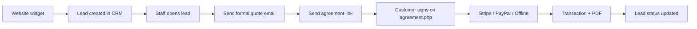

# LimoCRM — Complete Feature & Workflow Guide

Comprehensive inventory of everything LimoCRM (LimoGen) provides: modules, screens, automation, integrations, public surfaces, and how the pieces connect. Based on the repository at `limocrm/` as implemented.

**Related docs**

| Document | Purpose |
|----------|---------|
| [LIMOCRM_FEATURES_AND_ARCHITECTURE.md](./LIMOCRM_FEATURES_AND_ARCHITECTURE.md) | Technical architecture & API action table |
| [CLIENT_PITCH.md](./CLIENT_PITCH.md) | Short sales / email pitch |
| [CLIENT_PITCH_MODULES.md](./CLIENT_PITCH_MODULES.md) | Module-by-module sales language |
| [SECURITY_AND_QUALITY_AUDIT.md](./SECURITY_AND_QUALITY_AUDIT.md) | Security findings |
| [brochure/](./brochure/) | Visual brochure + screenshots |

---

## 1. What LimoCRM is

LimoCRM is an **all-in-one operating system for limousine companies**. It covers the journey from **website inquiry → lead → quote → agreement → payment → reporting**, with fleet, email, roles, and automation in one workspace.

It is **not** a Laravel/Livewire/React app. It is a **custom PHP UI** (Xintra-style admin theme) that:

1. Talks to **SuiteCRM** over HTTP via `CustomEntryPoint` (`config/api.php`)
2. Runs a **local MySQL workflow engine** (`app/Workflows/`, `api/`, `cron/`)
3. Hosts **public** pages (agreement signing, OTP explore login) and an **embeddable booking widget** (`limogen-widget/`)

**Authoritative business data** (leads, contacts, vehicles, users, emails, payments, etc.) lives in SuiteCRM. This repo is the logged-in front-end, public flows, widget, SQL/CEP deploy snippets, and the workflow runner.

---

## 2. Technology stack

| Layer | Choice |
|-------|--------|
| Server language | PHP (7.4+ / 8.x patterns) |
| Framework | None (page-based PHP) |
| CRM backend | SuiteCRM `CustomEntryPoint` |
| Local DB | MySQLi (`config/database.php`) — workflows + shared SuiteCRM tables |
| Composer | `tecnickcom/tcpdf` (agreement PDFs) |
| UI | PHP templates, Tailwind-style CSS, jQuery, SweetAlert2, Remix Icon, ApexCharts, Choices, Flatpickr |
| Maps (widget) | Leaflet + OSRM + Nominatim |
| Payments | Stripe.js, PayPal credentials, offline mode |
| OTP / explore | External mail-server API; optional Supabase logging on welcome flow |

---

## 3. System architecture

```
┌─────────────────────────────────────────────────────────────────┐
│  Browser                                                         │
│  • Staff UI (index.php, leads.php, …)                            │
│  • Public agreement.php                                          │
│  • Embeddable limogen-widget                                     │
└────────────┬───────────────────────────────┬────────────────────┘
             │                               │
             ▼                               ▼
┌────────────────────────┐     ┌─────────────────────────────────┐
│ config/api.php         │     │ Local MySQL workflow engine     │
│ curl → CustomEntryPoint│     │ app/Workflows + /api + cron     │
└────────────┬───────────┘     └────────────────┬────────────────┘
             ▼                                  ▼
┌────────────────────────┐     ┌─────────────────────────────────┐
│ SuiteCRM               │     │ limocrm_workflows* tables       │
│ (leads, contacts, …)   │◄────│ (reads leads; sends emails via  │
│ + limo_* custom tables │     │  SuiteCRM send_workflow_email)  │
└────────────────────────┘     └─────────────────────────────────┘
```

**Typical staff request**

```
User → PHP page → api.php → curlRequest(action=…) → SuiteCRM → JSON → UI
```

**Session**

- `$_SESSION['user']` holds identity, `admin` flag, and `role_permissions`
- Helpers: `config/session_permissions.php`, legacy ACL shaping in `acll.php`
- Layout gate in `components/layout/header.php` redirects unauthenticated users

---

## 4. Feature catalog (all modules)

### 4.1 Dashboard (`index.php`)

- KPI cards and charts for limousine sales
- Year-to-date: leads created per month, open pipeline additions, wins (`Converted` / `won` / `success`-style statuses)
- **Admin:** `fetchAllLeads` (team-wide)
- **Standard user:** `fetchAllUserLeads` (owned pipeline only)

### 4.2 Leads (sales pipeline)

| Page | Role |
|------|------|
| `leads.php` | Searchable lead list (table partial `components/tables/leads.php`) |
| `lead.php` | Single-lead workspace: details, email history, quote/agreement actions |
| `add_lead.php` | Create lead (`save_lead`) |
| `edit_lead.php` | Update lead (`update_lead`) |

**Lead workspace capabilities**

- View trip / contact / pricing fields
- Send lead email, **formal quote** email, **agreement** email
- Generate / open **agreement signing link**
- Related emails list and email detail
- Post-payment lead updates (`update_lead_after_payment`)

**Key API actions:** `fetchSingleLead`, `save_lead`, `update_lead`, `send_lead_email`, `send_formal_quote_email`, `send_agreement_email`, `fetch_lead_emails`, `fetch_single_email`, `get_agreement_signing_link`, `fetch_lead_stripe_key`, `submit_agreement`, `update_lead_after_payment`

### 4.3 Contacts

| Page | Role |
|------|------|
| `contacts.php` | Contact list |
| `contact_detail.php` | Detail view |
| `edit_contact.php` | Create / edit |

Long-term customer records separate from one-off leads (names, phones, address, description, lead source, do-not-call, primary email).

**API:** `fetch_contacts` / `fetch_contacts_list`, `fetch_contact_detail`, `save_contact`, `update_contact`, `delete_contact`

### 4.4 Notes

| Page | Role |
|------|------|
| `notes.php` | List / manage notes |
| `create_notes.php` | Create note entry |

Internal notes on CRM records for handoffs between sales, dispatch, and owners.

**API:** `fetch_notes`, `save_note`, `update_note`, `delete_note` (plus `createNote` helper)

### 4.5 Tasks (`task.php`)

- Full task UI (not currently linked in main sidebar)
- Create, list, update status, delete
- **API:** `fetch_tasks`, `save_task`, `update_task_status`, `delete_task`

### 4.6 Vehicles (fleet)

| Page | Role |
|------|------|
| `vehicles.php` | Fleet grid (`fetch_vehicles` with `is_admin`) |
| `vehicle.php` | Create / edit vehicle |
| `vehicle_detail.php` | Specs, gallery, pricing for one unit |

Catalog of limos with capacity, features, photos, status — sales quotes from what you actually run.

**API:** `fetch_vehicles`, `save_vehicle`, `get_vehicle`, `delete_vehicle`

### 4.7 Pricing (admin only) (`pricing.php`)

- Global defaults: hourly rate, fuel surcharge %, driver commission %
- Per-vehicle pricing overrides
- **API:** `fetch_pricing_defaults`, `save_pricing_defaults`, `update_vehicle_pricing`
- SQL: `database/limo_pricing_defaults.sql`

### 4.8 Agreements & payments

#### Staff-facing

| Page | Role |
|------|------|
| `agreements.php` | Agreement management / signing-link workflows |
| `config/get_agreement_link_endpoint.php` | AJAX helper for signing links |

#### Public signing (`agreement.php`)

Customers open a branded page (typically `agreement.php?lead_id=…`) to:

1. Review booking summary  
2. Sign electronically (signature canvas)  
3. Pay via **Stripe**, **PayPal**, or **offline** (per operator `preferred_payment`)  
4. Persist via `config/agreement_api.php` → SuiteCRM `submit_agreement`  
5. Generate **TCPDF** PDFs under `pdf/`

#### Payment admin

| Page | Role |
|------|------|
| `payment_methods.php` | Stripe keys, PayPal keys, preferred mode (`stripe` \| `paypal` \| `offline`), live/test |
| `transactions.php` | Payment ledger (`fetch_user_transactions`) |

**Deploy snippets:** `database/limo_user_stripe_keys.sql`, `limo_user_payment_method_columns.sql`, `limo_stripe_agreement.sql`, `custom_entry_point_stripe_keys.php`

### 4.9 Email (communications)

| Page | Access | Role |
|------|--------|------|
| `email_settings.php` | Admin | Outbound SMTP accounts CRUD + connection test |
| `email_templates.php` / `email_template.php` | Admin | Template list & editor |
| `email_analytics.php` | Admin | Open / engagement metrics |
| `email_detail.php` / `email_actions.php` | Supporting | Single-email views / actions |

**API:** templates CRUD; outbound account CRUD + `test_outbound_email_account_connection`; `fetch_user_email_analytics`; lead send helpers above.

**SQL / CEP:** `limo_outbound_email_accounts.sql`, `custom_entry_point_limo_outbound_email_accounts.php`, `custom_entry_point_outbound_email.php`

### 4.10 Reports & analytics (`reports.php`)

- Periods: month, quarter, year
- Funnel stages, geographic breakdown from addresses
- Revenue-style metrics from lead custom fields (rates/totals)
- Trend series for limousine operators
- Data via `fetchAllUserLeads` for the logged-in user

### 4.11 Workflows (local automation)

| Page | Role |
|------|------|
| `workflows.php` | List workflows |
| `create_workflow.php` | Create definition |
| `edit_workflow.php` | Edit definition |

Deep dive in **§5 Workflow automation engine**.

### 4.12 Integrations & booking widget

| Piece | Role |
|-------|------|
| `integration.php` | Embed snippet, live preview, domain stats, accent color + Google Font theme |
| `limogen-widget/widget.js` | Injects iframe with `data-user-id`, theme attrs, source hostname |
| `limogen-widget/widget-frame.php` | Full booking UX: map routing, vehicles, quote → `save_lead` |
| `instantQuoteForm.php` | Embed helper around the widget |

**API:** `fetch_embedded_domains`, `fetch_widget_theme`, `save_widget_theme`  
**SQL / CEP:** `limo_widget_theme.sql`, `custom_entry_point_widget_theme.php`

### 4.13 Users & roles (admin)

| Page | Role |
|------|------|
| `users.php` | Team CRUD (`create_user`, `update_user`, `delete_user`, `fetchAllTeamMembers`) |
| `role_management.php` | Roles + permission matrix |

**Permission modules in role UI (hard-coded):** Leads, Vehicles, Contacts, Notes, Agreements  
**Sidebar also gates:** Reports, Workflows, Integrations  
**CRUD flags:** `can_create`, `can_read`, `can_update`, `can_delete` per module  
**Admin** (`$_SESSION['user']['admin'] === 1`): full nav including Pricing, User Management, Payment Management, Email Management

### 4.14 Settings & profile

| Page | Role |
|------|------|
| `settings.php` | Profile display, password change |
| `profile.php` | User profile view/edit |

**Endpoints:** `config/change_password_endpoint.php`, `config/profile_update_endpoint.php`

### 4.15 Auth & onboarding

| Page | Role |
|------|------|
| `login.php` + `config/login.php` | Standard login → `user_login` → session |
| `config/logout.php` | Clear session |
| `signup.php` | Registration shell |
| `login_explore.php` | Demo / explore click-login |
| `welcome.php` | Marketing deep-link / OTP kickoff (lead UUID) |
| `otp_verify.php` | OTP verify → auto-login demo CRM user |

OTP uses `config/otp_mail_server.php` (external Vercel mail-server). Demo credentials: `config/demo_credentials.php`.

### 4.16 UX polish

- Guided intro wizard: `assets/js/limo-intro-wizard.js`, `limo-intro-vehicle.js` (vehicles → templates → integration → leads)
- Theme switcher (dark/light, menu styles) in header
- Session/visit logging under `logs/`

### 4.17 Placeholder / not active in sidebar

Commented in `components/layout/sidebar.php` (not shipped as active modules):

Vendors, Quotes, Calendar, Email Tracking, Commissions, Campaigns, Chat, Coupons, Vendor Tiers, Audit Log, System, Employee Analytics, Campaign Builder

### 4.18 Dev / test

- `tester.php`, `test.html`, `lead_test.js` — development aids

---

## 5. Workflow automation engine (detailed)

LimoCRM includes a **SuiteCRM-style, conditions-first** local workflow engine. Definitions and execution state live in MySQL; the cron runner evaluates triggers, conditions, and actions.

### 5.1 Components

| Piece | Path |
|-------|------|
| Controller / CRUD | `app/Workflows/WorkflowController.php` |
| Runner | `app/Workflows/WorkflowExecutionEngine.php` |
| Conditions | `app/Workflows/ConditionEvaluator.php` |
| DB / GUIDs | `app/Workflows/Db.php`, `Guid.php` |
| HTTP API | `api/index.php` (+ `.htaccess`) |
| Primary cron | `cron/workflow_engine.php` |
| Alternate cron | `cron/workflow_executor.php` |
| UI | `workflows.php`, `create_workflow.php`, `edit_workflow.php` |
| Canonical migration | `sql/workflow_engine_rebuild_migration.sql` |
| Older schemas | `sql/workflow_automation_schema.sql`, `sql/workflow_simple_schema.sql` |

### 5.2 Database tables

Run `sql/workflow_engine_rebuild_migration.sql` against the DB in `config/database.php`.

| Table | Purpose |
|-------|---------|
| `limocrm_workflows` | Definition: name, module, trigger, status, run_once |
| `limocrm_workflow_conditions` | Field/operator/value + condition groups |
| `limocrm_workflow_actions` | Ordered action chain |
| `limocrm_workflow_execution_log` | Per workflow+record state machine |

### 5.3 Triggers (`trigger_type`)

| Trigger | Meaning | Runtime support (v1) |
|---------|---------|----------------------|
| `on_create` | New record | **Leads** — `date_entered` within last ~5 minutes |
| `on_update` | Record modified | **Leads** — `date_modified` within last ~5 minutes |
| `on_field_change` | Field equals value after modify | **Leads** — approximate via modify window + field match |
| `on_date` | Date-based | Stored; not fully executed in v1 runner |
| `scheduled` | Schedule-based | Stored; not fully executed in v1 runner |

Field introspection for UI supports modules: **Leads**, **Contacts**, **AOS_Quotes**.

### 5.4 Conditions

- **Empty conditions = fail** (workflows require at least one condition)
- **AND** within a `condition_group`
- **OR** between groups

| Operator | Behavior |
|----------|----------|
| `equals` / `not_equals` | Exact string match |
| `contains` / `not_contains` | Case-insensitive substring |
| `starts_with` / `ends_with` | Prefix / suffix |
| `greater_than` / `less_than` | Numeric compare when both sides numeric |
| `is_empty` / `is_not_empty` | Null or blank string |

### 5.5 Actions (`action_type`)

| Action | Behavior in v1 |
|--------|----------------|
| `send_email` | Calls SuiteCRM `send_workflow_email` with `email_template_id` |
| `delay` | Pauses execution; sets log `waiting` + `next_run_at` (minutes/hours/days/weeks) |
| `update_field` | Updates field on **Leads** (`leads` / `leads_cstm`) |
| `change_status` | Same path as `update_field` |
| `webhook` | HTTP GET/POST to `webhook_url` with `{ module, record_id }` JSON on POST |
| `create_task` | Stored in UI/DB; **noop** at runtime |
| `send_notification` | Stored in UI/DB; **noop** at runtime |

Execution is sequential (`sort_order`). Max 25 steps per advance. Statuses: `pending`, `running`, `waiting`, `completed`, `failed`.

**`run_once`:** if enabled, skips a record that already has any execution log for that workflow.

### 5.6 REST API (`/api/*`)

| Method | Path | Purpose |
|--------|------|---------|
| GET | `/api/workflows` | List |
| POST | `/api/workflows` | Create |
| GET | `/api/workflows/:id` | Get + conditions + actions |
| PUT | `/api/workflows/:id` | Update |
| DELETE | `/api/workflows/:id` | Soft-delete |
| GET | `/api/workflows/module-fields/:module` | Field introspection |
| GET | `/api/email-templates` | Template picker |
| POST | `/api/workflows/:id/execute-now` | Trigger a run cycle |
| GET | `/api/workflows/:id/logs` | Execution logs |

### 5.7 Cron setup

```bash
php /path/to/limocrm/cron/workflow_engine.php
```

Recommended: every **60 seconds** (Windows Task Scheduler or Linux cron `* * * * *`).

Each run:

1. Resumes `running` / `waiting` logs whose `next_run_at` is due  
2. Loads Active workflows  
3. Fetches triggered records  
4. Evaluates conditions  
5. Starts / advances action chains  

### 5.8 Example automation ideas

| Goal | Trigger | Conditions | Actions |
|------|---------|------------|---------|
| Welcome new web lead | `on_create` | Status = New, source contains Widget | `send_email` (welcome template) |
| Hot lead follow-up | `on_field_change` status=Hot | Status equals Hot | `delay` 1 day → `send_email` |
| Mark stale | `on_update` | Status equals New | `delay` 3 days → `update_field` status=Follow Up |
| External notify | `on_create` | Amount greater than X | `webhook` POST to Zapier/Make |

---

## 6. End-to-end business workflows

These are the **product journeys** (not the automation engine).

### 6.1 Website visitor → paid booking



1. Embed widget from **Integrations** on the operator site  
2. Visitor gets instant quote (map + fleet + pricing) → lead via `save_lead`  
3. Domain / source tracked (`fetch_embedded_domains`)  
4. Sales works the lead; sends quote / agreement from lead detail  
5. Customer signs and pays on public agreement page  
6. Payment appears in **Transactions**; PDF stored under `pdf/`

### 6.2 Manual lead → close

1. **Add Lead** with trip details (pickup, dropoff, date, passengers, vehicle, assignee)  
2. Attach **Notes** / **Tasks** for follow-up  
3. Optionally convert / link to **Contact** for repeat business  
4. Quote → agreement → payment (same as above)  
5. Track in **Dashboard** / **Reports**

### 6.3 Explore / demo funnel

1. Marketing link → `welcome.php` (lead UUID)  
2. OTP sent via mail-server → `otp_verify.php`  
3. Auto-login demo user → product tour / intro wizard  

### 6.4 Team onboarding (admin)

1. Create **Roles** with module CRUD matrix  
2. Create **Users** and assign roles  
3. Configure **Pricing**, **Payment methods**, **Email SMTP**, **Templates**  
4. Set **Widget theme** on Integrations  
5. Optionally create **Workflows** for auto follow-up  

### 6.5 Automated follow-up (engine)

1. Admin creates workflow in UI (trigger + conditions + actions)  
2. Cron runs every minute  
3. Matching leads get emails / field updates / webhooks without staff clicks  

---

## 7. Authentication & authorization

| Concern | Behavior |
|---------|----------|
| Login | POST → SuiteCRM `user_login` → `$_SESSION['user']` |
| Session gate | Layout redirects if no session user |
| Admin full access | `(int)$_SESSION['user']['admin'] === 1` |
| Module nav | `limo_nav_can_module('ModuleName')` — any of create/read/update/delete |
| Fine-grained | `limo_user_module_access($module, $access)` |
| ACL labels | Normalized in `acll.php` (e.g. lead → leads) |
| Explore OTP | External OTP APIs + demo credentials |

**Active sidebar permission keys:** Leads, Vehicles, Agreements, Notes, Contacts, Reports, Workflows, Integrations  
**Admin-only sections:** Pricing, Users, Roles, Transactions, Payment methods, Email settings/templates/analytics  
**Always shown:** Dashboard, Settings (for logged-in users)

---

## 8. Integrations summary

| Integration | Purpose |
|-------------|---------|
| SuiteCRM CustomEntryPoint | Primary backend API for almost all CRM data |
| Stripe | Per-user keys; public agreement checkout; transaction log |
| PayPal | Client ID/secret + preferred_payment |
| SMTP outbound | Per-account SMTP stored in CRM (`limo_outbound_email_accounts`) |
| OTP mail-server | Send/verify OTP for explore login |
| Supabase | Welcome-flow activity logging (where configured) |
| Leaflet / OSRM / Nominatim | Widget geocoding & routing |
| TCPDF | Agreement PDF generation |
| Google Fonts | Widget theme fonts |

SuiteCRM handler snippets to deploy live under `database/custom_entry_point_*.php`.

---

## 9. Public-facing surfaces

| Surface | Entry | Notes |
|---------|-------|-------|
| Agreement signing | `agreement.php` | E-sign + pay; no staff session required |
| Booking widget | `limogen-widget/widget.js` → iframe | `data-user-id` required |
| Instant quote helper | `instantQuoteForm.php` | Embed helper |
| Welcome / OTP | `welcome.php` → `otp_verify.php` | Demo / marketing funnel |
| Signup | `signup.php` | Public registration shell |
| Explore login | `login_explore.php` | Demo accounts |

---

## 10. SuiteCRM API surface (`config/api.php`)

All wrappers POST an `action` (and fields) to CustomEntryPoint. Full mapping:

| Area | Actions (representative) |
|------|--------------------------|
| Auth | `user_login` |
| Leads | `fetchAllLeads`, `fetchAllUserLeads`, `fetchSingleLead`, `save_lead`, `update_lead`, `update_lead_after_payment` |
| Lead email | `send_lead_email`, `send_formal_quote_email`, `send_agreement_email`, `fetch_lead_emails`, `fetch_single_email` |
| Contacts | `fetch_contacts`, `fetch_contacts_list`, `fetch_contact_detail`, `save_contact`, `update_contact`, `delete_contact` |
| Notes | `fetch_notes`, `save_note`, `update_note`, `delete_note`, `createNote` |
| Tasks | `fetch_tasks`, `save_task`, `update_task_status`, `delete_task` |
| Vehicles / pricing | `fetch_vehicles`, `save_vehicle`, `get_vehicle`, `delete_vehicle`, `fetch_pricing_defaults`, `save_pricing_defaults`, `update_vehicle_pricing` |
| Users / roles | `create_user`, `update_user`, `delete_user`, `fetchAllTeamMembers`, `create_role`, `fetch_roles`, `update_role`, `delete_role`, `get_module_template`, `fetch_current_user_permissions` |
| Email admin | Template CRUD; outbound account CRUD + connection test; `fetch_user_email_analytics` |
| Widget | `fetch_embedded_domains`, `fetch_widget_theme`, `save_widget_theme` |
| Agreements / pay | `fetch_agreement_lead`, `submit_agreement`, `get_agreement_signing_link`, `fetch_lead_stripe_key`, Stripe/PayPal key CRUD, `save_user_payment_preference`, `fetch_user_transactions`, `fetch_payment_methods` |
| Workflows (CRM) | `fetch_workflows`, `delete_workflow` (legacy/CRM-side; local engine uses `/api`) |
| Workflow email | `send_workflow_email` (called from engine, not always wrapped in api.php) |

See [LIMOCRM_FEATURES_AND_ARCHITECTURE.md](./LIMOCRM_FEATURES_AND_ARCHITECTURE.md) §6 for the PHP function ↔ action table.

---

## 11. Database artifacts in this repo

### Workflow (local / shared SuiteCRM DB)

- `sql/workflow_engine_rebuild_migration.sql` — canonical

### Limo custom tables (deploy on SuiteCRM DB)

| SQL file | Purpose |
|----------|---------|
| `limo_user_stripe_keys.sql` | Stripe credentials per user |
| `limo_user_payment_method_columns.sql` | Preferred payment + PayPal columns |
| `limo_stripe_agreement.sql` | Stripe transactions (+ optional lead/contact stripe customer fields) |
| `limo_outbound_email_accounts.sql` | SMTP outbound accounts |
| `limo_widget_theme.sql` | Widget accent/font theme |
| `limo_pricing_defaults.sql` | Global pricing defaults |

Config sample: `database/limo_agreement_config.sample.php` → `config/agreement_config.php`

---

## 12. Repository layout

| Path | Role |
|------|------|
| `*.php` (root) | Feature pages |
| `config/` | API bridge, auth, DB, AJAX endpoints, OTP, agreements |
| `components/layout/` | header, sidebar, footer |
| `components/tables/` | Shared table partials |
| `app/Workflows/` | Workflow engine classes |
| `api/` | Workflow REST router |
| `cron/` | Workflow cron runners |
| `database/` | SuiteCRM SQL + CustomEntryPoint snippets |
| `sql/` | Workflow schema migrations |
| `limogen-widget/` | Embeddable booking widget |
| `assets/` | Theme CSS/JS/images/libs |
| `pdf/` | Generated agreement PDFs |
| `logs/` | App / session / visit logs |
| `docs/` | Documentation, pitch, brochure |
| `vendor/` | Composer (TCPDF) |

---

## 13. Page inventory (quick reference)

**Core app:** `index`, `leads`, `lead`, `add_lead`, `edit_lead`, `contacts`, `contact_detail`, `edit_contact`, `notes`, `create_notes`, `task`, `vehicles`, `vehicle`, `vehicle_detail`, `pricing`, `agreements`, `agreement`, `reports`, `workflows`, `create_workflow`, `edit_workflow`, `integration`, `users`, `role_management`, `transactions`, `payment_methods`, `email_settings`, `email_templates`, `email_template`, `email_analytics`, `email_detail`, `email_actions`, `settings`, `profile`

**Auth / public:** `login`, `login_explore`, `otp_verify`, `welcome`, `signup`, `instantQuoteForm`

**Config endpoints:** `api.php`, `login.php`, `logout.php`, `database.php`, `session_permissions.php`, `otp_mail_server.php`, `demo_credentials.php`, `agreement_api.php`, `agreement_config.php`, `save_lead_endpoint.php`, `update_lead_endpoint.php`, `send_lead_email_endpoint.php`, `get_agreement_link_endpoint.php`, `outbound_email_endpoint.php`, `change_password_endpoint.php`, `profile_update_endpoint.php`

---

## 14. Product capabilities at a glance

| Capability | Status |
|------------|--------|
| Lead pipeline (list/detail/create/edit) | Active |
| Contacts | Active |
| Notes | Active |
| Tasks | Active (page exists; not in main sidebar) |
| Fleet / vehicles | Active |
| Pricing defaults | Active (admin) |
| Agreements + e-sign + PDF | Active |
| Stripe / PayPal / offline payments | Active |
| Transaction ledger | Active (admin) |
| Email templates + SMTP + analytics | Active (admin) |
| Reports & analytics | Active |
| Local workflow automation | Active (Leads runtime v1) |
| Embeddable booking widget + theme | Active |
| Users & role permissions | Active (admin) |
| OTP explore / demo login | Active |
| Intro / onboarding wizard | Active |
| Vendors, Quotes, Calendar, Campaigns, Chat, etc. | Placeholder only (sidebar commented) |

---

## 15. Maintaining this document

When adding a feature:

1. Implement SuiteCRM `CustomEntryPoint` action if data is CRM-backed  
2. Add PHP page + `config/api.php` wrapper as needed  
3. Gate with `limo_nav_can_module` / admin checks in sidebar  
4. Update **§4 Feature catalog**, **§6 journeys** (if user-facing), and **§10 API**  
5. For automation changes, update **§5** and `sql/` migrations  

---

*Generated from repository structure and source analysis. SuiteCRM handler behavior for each `action` is defined on the CRM server and may extend beyond what this UI exercises.*
