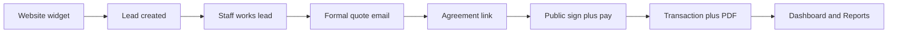

# LimoCRM — Next.js Rebuild Spec (Agent Bible)

This document is the **handoff for rebuilding LimoCRM as a full-stack Next.js app**. It replaces PHP + SuiteCRM. Do **not** call SuiteCRM `CustomEntryPoint`. Port behavior from this PHP repository; when CRM-side logic is missing, match the PHP UI.

**Related PHP docs (behavior / screenshots, not architecture to copy):**

| Document | Use for |
|----------|---------|
| [LIMOCRM_COMPLETE_FEATURE_GUIDE.md](./LIMOCRM_COMPLETE_FEATURE_GUIDE.md) | Feature catalog, journeys, workflow engine as implemented today |
| [LIMOCRM_FEATURES_AND_ARCHITECTURE.md](./LIMOCRM_FEATURES_AND_ARCHITECTURE.md) | PHP API action table |
| [SECURITY_AND_QUALITY_AUDIT.md](./SECURITY_AND_QUALITY_AUDIT.md) | Vulnerabilities **not** to clone |
| [brochure/screenshots/](./brochure/screenshots/) | Visual parity |

**Decision locked:** Next.js App Router owns UI, API, auth, and database. Isolation is **single-org CRM with user-scoped rows** (not multi-tenant SaaS).

**Do not scaffold Next.js until a human explicitly asks.** This file is the spec only.

---

## 0. How a rebuild agent should use this file

1. Scaffold the stack in §2 and folder layout in §3.
2. Implement Prisma schema in §4 **before** screens.
3. Implement auth/RBAC in §5, then modules in the order in §17.
4. For each screen, read the **PHP source** listed in §16 as the visual/UX spec.
5. If PHP and this spec disagree on a **live** behavior, match PHP UI. If they disagree on **security**, follow this spec (do not clone PHP holes).
6. Skip §18 placeholders. Include Tasks in the sidebar even though PHP does not.

---

## 1. Product

LimoCRM is an operating system for limousine companies:

**Website inquiry → lead → quote → agreement → payment → report**, plus fleet, email, roles, and automation.



Staff (admin) see all records. Non-admins see records they own (`assignedUserId` / `ownerId`). Per-user config: Stripe/PayPal keys, widget theme, pricing defaults, SMTP accounts.

---

## 2. Target stack

| Layer | Current PHP | Next.js target |
|-------|-------------|----------------|
| App | Page PHP + jQuery | Next.js App Router (TypeScript) |
| Auth | PHP session + SuiteCRM `user_login` | Auth.js (Credentials) + HTTP-only session cookie |
| Data | SuiteCRM MySQL + local workflow tables | PostgreSQL + Prisma |
| API | `config/api.php` POST `action=` | Server actions + Route Handlers |
| Validation | Ad-hoc PHP | Zod on every mutation |
| Email send | SuiteCRM SMTP tables | Nodemailer from `OutboundEmailAccount` (Resend optional later) |
| PDF | TCPDF → `pdf/` | pdf-lib or `@react-pdf/renderer` → object storage |
| Files | SuiteCRM URLs, local `pdf/` | S3 / R2 / local disk; vehicle images max 3 |
| Jobs | CLI cron every 60s | Vercel Cron **or** BullMQ worker hitting `GET /api/cron/workflows` |
| Maps | Leaflet + OSRM + Nominatim | Keep the same (no Google Maps) |
| Pay | Stripe.js + PayPal + offline | Same providers; **server-verify** Stripe and PayPal |
| UI | Xintra theme, Tailwind-style CSS, Remix Icon, ApexCharts, Flatpickr, SweetAlert2 | Same visual language |

### Environment variables (never hardcode)

```
DATABASE_URL
AUTH_SECRET
NEXTAUTH_URL / AUTH_URL
NEXT_PUBLIC_APP_URL
CRON_SECRET

# Optional marketing funnel
OTP_MAIL_SERVER_BASE
OTP_MAIL_SERVER_KEY

# File storage
S3_BUCKET
S3_REGION
S3_ACCESS_KEY
S3_SECRET_KEY
S3_ENDPOINT          # if R2 / MinIO
```

Stripe/PayPal/SMTP secrets live **in the database per user** (`PaymentCredentials`, `OutboundEmailAccount`), not in env, except a fallback publishable key is optional for local demo.

Do **not** copy PHP hardcoded DB password, SuiteCRM URL, Supabase service role key, or `demo_credentials.php` into the repo.

---

## 3. App structure and route map

```
app/
  (auth)/
    login/page.tsx
    signup/page.tsx
    welcome/page.tsx
    otp-verify/page.tsx
    login-explore/page.tsx
  (public)/
    agreement/[token]/page.tsx     # signed token, not raw UUID
    widget/page.tsx                # iframe booking UI
    w/[userId]/page.tsx            # optional alias
  (app)/                           # gated layout: sidebar + header
    layout.tsx
    page.tsx                       # dashboard
    leads/page.tsx
    leads/new/page.tsx
    leads/[id]/page.tsx
    leads/[id]/edit/page.tsx
    contacts/page.tsx
    contacts/[id]/page.tsx
    contacts/[id]/edit/page.tsx
    notes/page.tsx
    tasks/page.tsx
    vehicles/page.tsx
    vehicles/new/page.tsx
    vehicles/[id]/page.tsx
    vehicles/[id]/edit/page.tsx
    pricing/page.tsx
    agreements/page.tsx
    reports/page.tsx
    workflows/page.tsx
    workflows/new/page.tsx
    workflows/[id]/page.tsx
    integrations/page.tsx
    users/page.tsx
    roles/page.tsx
    transactions/page.tsx
    payment-methods/page.tsx
    email/settings/page.tsx
    email/templates/page.tsx
    email/templates/[id]/page.tsx
    email/analytics/page.tsx
    email/[id]/page.tsx
    settings/page.tsx
    profile/page.tsx
  api/
    auth/[...nextauth]/route.ts
    widget/vehicles/route.ts
    widget/theme/route.ts
    widget/leads/route.ts
    agreements/[token]/route.ts
    agreements/[token]/submit/route.ts
    email/track/[id]/route.ts
    email/unsubscribe/[id]/route.ts
    cron/workflows/route.ts
    webhooks/stripe/route.ts
    uploads/vehicle-image/route.ts
lib/
  auth.ts
  db.ts
  permissions.ts
  pricing.ts
  email.ts
  pdf.ts
  workflows/
  maps.ts
prisma/schema.prisma
components/                        # layout, tables, charts, forms
public/widget.js                   # embed loader
```

### PHP page → Next.js route

| PHP | Next.js | Auth |
|-----|---------|------|
| `index.php` | `/` | session |
| `leads.php` | `/leads` | Leads read |
| `lead.php?id=` | `/leads/[id]` | Leads read |
| `add_lead.php` | `/leads/new` | Leads create |
| `edit_lead.php?id=` | `/leads/[id]/edit` | Leads update |
| `contacts.php` | `/contacts` | Contacts read |
| `contact_detail.php` | `/contacts/[id]` | Contacts read |
| `edit_contact.php` | `/contacts/[id]/edit` | Contacts update |
| `notes.php` / `create_notes.php` | `/notes` | Notes |
| `task.php` | `/tasks` | Tasks (link in sidebar) |
| `vehicles.php` | `/vehicles` | Vehicles read |
| `vehicle.php` | `/vehicles/new` or `/vehicles/[id]/edit` | Vehicles create/update |
| `vehicle_detail.php` | `/vehicles/[id]` | Vehicles read |
| `pricing.php` | `/pricing` | admin |
| `agreements.php` | `/agreements` | Agreements read |
| `agreement.php?lead_id=` | `/agreement/[token]` | public |
| `reports.php` | `/reports` | Reports |
| `workflows.php` | `/workflows` | Workflows |
| `create_workflow.php` | `/workflows/new` | Workflows |
| `edit_workflow.php` | `/workflows/[id]` | Workflows |
| `integration.php` | `/integrations` | Integrations |
| `users.php` | `/users` | admin |
| `role_management.php` | `/roles` | admin |
| `transactions.php` | `/transactions` | admin |
| `payment_methods.php` | `/payment-methods` | admin |
| `email_settings.php` | `/email/settings` | admin |
| `email_templates.php` | `/email/templates` | admin |
| `email_template.php` | `/email/templates/[id]` | admin |
| `email_analytics.php` | `/email/analytics` | admin |
| `email_detail.php` | `/email/[id]` | admin / lead owner |
| `email_actions.php` | `/api/email/track/[id]`, `/api/email/unsubscribe/[id]` | public |
| `settings.php` | `/settings` | session |
| `profile.php` | `/profile` | session |
| `login.php` | `/login` | public |
| `signup.php` | `/signup` | public |
| `welcome.php` | `/welcome` | public |
| `otp_verify.php` | `/otp-verify` | public |
| `login_explore.php` | `/login-explore` | public |
| `instantQuoteForm.php` + `limogen-widget/widget-frame.php` | `/widget` | public |
| `limogen-widget/widget.js` | `/widget.js` | public static |

---

## 4. Prisma schema (canonical)

Use PostgreSQL. IDs: `cuid()`. Soft-delete with `deletedAt DateTime?` (query `deletedAt: null` everywhere). Timestamps: `createdAt` / `updatedAt`.

Drop SuiteCRM `*_c` suffixes. Map old names in comments.

```prisma
generator client {
  provider = "prisma-client-js"
}

datasource db {
  provider = "postgresql"
  url      = env("DATABASE_URL")
}

enum UserStatus {
  Active
  Inactive
}

enum PermissionModule {
  Leads
  Vehicles
  Contacts
  Notes
  Agreements
  Reports
  Workflows
  Integrations
  Tasks
}

enum LeadStatus {
  New
  Assigned
  InProcess          // PHP: "In Process"
  Formal             // workflow UI; include even if edit-lead dropdown omits it
  AgreementSent      // PHP: "Agreement Sent"
  Converted
  Recycled
  Dead
}

enum VehicleStatus {
  Active
  Inactive
  Maintenance
}

enum VehicleCategory {
  Sedan
  SUV
  StretchLimo
  StretchSuvLimo
  MiniBus
  MotorCoach
  PartyBus
  Limousine
  Sprinter
  Van
  ExecutiveBus
  Coach
  Motorcoach
}

enum NoteParentType {
  Lead
  Contact
  General
}

enum TaskStatus {
  NotStarted         // PHP: "Not Started"  (kanban: To Do)
  InProgress         // PHP: "In Progress"
  PendingInput       // PHP: "Pending Input" (kanban: Review)
  Completed
}

enum TaskPriority {
  High
  Medium
  Low
}

enum PreferredPayment {
  stripe
  paypal
  offline
}

enum EmailAccountType {
  system
  personal
}

enum TransactionStatus {
  pending
  succeeded
  failed
  refunded
}

enum PaymentProvider {
  stripe
  paypal
  offline
}

enum WorkflowStatus {
  Active
  Inactive
}

enum WorkflowTrigger {
  on_create
  on_update
  on_field_change
  on_date
  scheduled
}

enum ConditionOperator {
  equals
  not_equals
  contains
  not_contains
  greater_than
  less_than
  is_empty
  is_not_empty
  starts_with
  ends_with
}

enum WorkflowActionType {
  send_email
  delay
  update_field
  create_task
  change_status
  send_notification
  webhook
}

enum DelayUnit {
  minutes
  hours
  days
  weeks
}

enum ExecutionStatus {
  pending
  running
  waiting
  completed
  failed
}

model User {
  id           String     @id @default(cuid())
  userName     String     @unique
  email        String     @unique
  passwordHash String
  firstName    String
  lastName     String
  phone        String?
  isAdmin      Boolean    @default(false)
  status       UserStatus @default(Active)
  roleId       String?
  role         Role?      @relation(fields: [roleId], references: [id])
  createdAt    DateTime   @default(now())
  updatedAt    DateTime   @updatedAt
  deletedAt    DateTime?

  assignedLeads     Lead[]              @relation("LeadAssignee")
  ownedLeads        Lead[]              @relation("LeadOwner")
  vehicles          Vehicle[]
  notes             Note[]
  tasksAssigned     Task[]              @relation("TaskAssignee")
  tasksCreated      Task[]              @relation("TaskCreator")
  contacts          Contact[]
  emailsSent        EmailMessage[]
  outboundAccounts  OutboundEmailAccount[]
  paymentCreds      PaymentCredentials?
  pricingDefaults   PricingDefaults?
  widgetTheme       WidgetTheme?
  workflowsCreated  Workflow[]
}

model Role {
  id          String           @id @default(cuid())
  name        String
  description String?
  createdAt   DateTime         @default(now())
  updatedAt   DateTime         @updatedAt
  deletedAt   DateTime?
  users       User[]
  permissions RolePermission[]
}

model RolePermission {
  id         String           @id @default(cuid())
  roleId     String
  role       Role             @relation(fields: [roleId], references: [id], onDelete: Cascade)
  module     PermissionModule
  canCreate  Boolean          @default(false)
  canRead    Boolean          @default(false)
  canUpdate  Boolean          @default(false)
  canDelete  Boolean          @default(false)

  @@unique([roleId, module])
}

model Lead {
  id             String     @id @default(cuid())
  firstName      String
  lastName       String
  email          String?
  phone          String?
  status         LeadStatus @default(New)
  assignedUserId String?
  assignedUser   User?      @relation("LeadAssignee", fields: [assignedUserId], references: [id])
  ownerId        String     // fleet operator; Stripe/PayPal lookup
  owner          User       @relation("LeadOwner", fields: [ownerId], references: [id])

  serviceType         String?
  eventDate           DateTime?
  passengers          Int?
  serviceLengthHours  Decimal?  @db.Decimal(8, 2)
  pickupAddress       String?
  dropoffAddress      String?
  notes               String?   @db.Text
  distance            String?   // widget route miles
  duration            String?   // widget route duration
  leadSource          String?
  embedDomain         String?   // hostname of embedding site

  hourlyRate               Decimal? @db.Decimal(16, 2)  // PHP rate_c
  fuelAmount               Decimal? @db.Decimal(16, 2)  // PHP fuel_c (money, not %)
  driverCommissionAmount   Decimal? @db.Decimal(16, 2)  // PHP driver_commission_c
  totalPrice               Decimal? @db.Decimal(16, 2)  // PHP total_price_c

  vehicleId                String?
  vehicle                  Vehicle? @relation(fields: [vehicleId], references: [id])
  vehicleName              String?
  vehicleImages            String?  @db.Text  // comma-separated URLs snapshot
  vehicleFacilities        String?  @db.Text
  vehicleFuelPct           Decimal? @db.Decimal(8, 4)
  vehicleCommissionPct     Decimal? @db.Decimal(8, 4)

  agreementPdfUrl    String?
  agreementSignedAt  DateTime?
  agreementToken     String?   @unique  // signed public link

  createdAt DateTime  @default(now())
  updatedAt DateTime  @updatedAt
  deletedAt DateTime?

  notesRel       Note[]
  emails         EmailMessage[]
  transactions   Transaction[]

  @@index([ownerId, status])
  @@index([assignedUserId])
  @@index([embedDomain])
  @@index([createdAt])
}

model Vehicle {
  id                   String         @id @default(cuid())
  name                 String
  category             VehicleCategory
  status               VehicleStatus  @default(Active)
  passengerCapacity    Int            @default(0)
  bagCapacity          Int            @default(0)
  hourlyRate           Decimal        @db.Decimal(16, 2)
  fuelPct              Decimal        @db.Decimal(8, 4)  // % of quoted subtotal
  driverCommissionPct  Decimal        @db.Decimal(8, 4)
  facilities           String?        // comma-separated
  description          String?        @db.Text
  images               String[]       // max 3 URLs; enforce in app
  ownerId              String
  owner                User           @relation(fields: [ownerId], references: [id])
  createdAt            DateTime       @default(now())
  updatedAt            DateTime       @updatedAt
  deletedAt            DateTime?
  leads                Lead[]
}

model Contact {
  id          String   @id @default(cuid())
  firstName   String
  lastName    String
  title       String?
  department  String?
  email       String?
  phoneMobile String?
  phoneWork   String?
  street      String?
  city        String?
  state       String?
  postal      String?
  country     String?
  description String?  @db.Text
  leadSource  String?
  doNotCall   Boolean  @default(false)
  ownerId     String
  owner       User     @relation(fields: [ownerId], references: [id])
  createdAt   DateTime @default(now())
  updatedAt   DateTime @updatedAt
  deletedAt   DateTime?
  notes       Note[]
}

model Note {
  id          String         @id @default(cuid())
  subject     String
  body        String         @db.Text
  parentType  NoteParentType @default(General)
  leadId      String?
  lead        Lead?          @relation(fields: [leadId], references: [id])
  contactId   String?
  contact     Contact?       @relation(fields: [contactId], references: [id])
  createdById String
  createdBy   User           @relation(fields: [createdById], references: [id])
  createdAt   DateTime       @default(now())
  updatedAt   DateTime       @updatedAt
  deletedAt   DateTime?
}

model Task {
  id           String       @id @default(cuid())
  subject      String
  description  String?      @db.Text
  status       TaskStatus   @default(NotStarted)
  priority     TaskPriority @default(Medium)
  dueDate      DateTime?
  assignedToId String?
  assignedTo   User?        @relation("TaskAssignee", fields: [assignedToId], references: [id])
  createdById  String
  createdBy    User         @relation("TaskCreator", fields: [createdById], references: [id])
  createdAt    DateTime     @default(now())
  updatedAt    DateTime     @updatedAt
  deletedAt    DateTime?
}

model EmailTemplate {
  id        String   @id @default(cuid())
  name      String
  subject   String
  htmlBody  String   @db.Text
  ownerId   String?
  createdAt DateTime @default(now())
  updatedAt DateTime @updatedAt
  deletedAt DateTime?
  emails    EmailMessage[]
}

model EmailMessage {
  id              String    @id @default(cuid())
  toEmail         String
  subject         String
  htmlBody        String    @db.Text
  leadId          String?
  lead            Lead?     @relation(fields: [leadId], references: [id])
  templateId      String?
  template        EmailTemplate? @relation(fields: [templateId], references: [id])
  sentById        String?
  sentBy          User?     @relation(fields: [sentById], references: [id])
  openedAt        DateTime?
  openCount       Int       @default(0)
  unsubscribedAt  DateTime?
  createdAt       DateTime  @default(now())
}

model OutboundEmailAccount {
  id              String          @id @default(cuid())
  name            String
  accountType     EmailAccountType @default(system)
  createdById     String
  createdBy       User            @relation(fields: [createdById], references: [id])
  assignedUserId  String?
  smtpHost        String
  smtpPort        String          @default("587")
  smtpSsl         String          @default("1")  // 0 none, 1 SSL, 2 TLS — match PHP
  smtpAuth        Boolean         @default(true)
  smtpUser        String          @default("")
  smtpPass        String?         @db.Text      // encrypt at rest
  fromName        String          @default("")
  fromAddr        String          @default("")
  replyToName     String          @default("")
  replyToAddr     String          @default("")
  signature       String?         @db.Text
  createdAt       DateTime        @default(now())
  updatedAt       DateTime        @updatedAt
  deletedAt       DateTime?
}

model PaymentCredentials {
  id                   String            @id @default(cuid())
  userId               String            @unique
  user                 User              @relation(fields: [userId], references: [id])
  stripePublishableKey String            @default("")
  stripeSecretKey      String            @default("")  // encrypt at rest
  stripeLive           Boolean           @default(false)
  paypalClientId       String            @default("")
  paypalSecret         String            @default("")  // encrypt at rest
  paypalLive           Boolean           @default(false)
  preferredPayment     PreferredPayment  @default(offline)
  connectedAt          DateTime?
  createdAt            DateTime          @default(now())
  updatedAt            DateTime          @updatedAt
}

model Transaction {
  id                    String             @id @default(cuid())
  leadId                String
  lead                  Lead               @relation(fields: [leadId], references: [id])
  amountCents           Int
  currency              String             @default("usd")
  status                TransactionStatus  @default(pending)
  provider              PaymentProvider
  stripePaymentIntentId String?
  paypalOrderId         String?
  description           String?
  signatureFile         String?
  rawResponse           String?            @db.Text
  createdAt             DateTime           @default(now())
  deletedAt             DateTime?

  @@index([leadId])
}

model PricingDefaults {
  id                   String   @id @default(cuid())
  userId               String   @unique
  user                 User     @relation(fields: [userId], references: [id])
  defaultHourlyRate    Decimal  @default(0) @db.Decimal(16, 2)
  fuelSurchargePct     Decimal  @default(0) @db.Decimal(8, 4)
  driverCommissionPct  Decimal  @default(0) @db.Decimal(8, 4)
  createdAt            DateTime @default(now())
  updatedAt            DateTime @updatedAt
}

model WidgetTheme {
  id          String   @id @default(cuid())
  userId      String   @unique
  user        User     @relation(fields: [userId], references: [id])
  accentColor String   @default("#6366f1")
  fontFamily  String   @default("Inter")
  createdAt   DateTime @default(now())
  updatedAt   DateTime @updatedAt
}

model Workflow {
  id           String           @id @default(cuid())
  name         String
  moduleName   String           @default("Leads")
  triggerType  WorkflowTrigger
  triggerField String?
  triggerValue String?
  status       WorkflowStatus   @default(Active)
  description  String?          @db.Text
  runOnce      Boolean          @default(true)
  createdById  String?
  createdBy    User?            @relation(fields: [createdById], references: [id])
  createdAt    DateTime         @default(now())
  updatedAt    DateTime         @updatedAt
  deletedAt    DateTime?
  conditions   WorkflowCondition[]
  actions      WorkflowAction[]
  logs         WorkflowExecutionLog[]
}

model WorkflowCondition {
  id         String             @id @default(cuid())
  workflowId String
  workflow   Workflow           @relation(fields: [workflowId], references: [id], onDelete: Cascade)
  field      String
  operator   ConditionOperator
  value      String?
  group      Int                @default(1)  // AND within group, OR between groups
  sortOrder  Int                @default(0)
  deletedAt  DateTime?
}

model WorkflowAction {
  id              String             @id @default(cuid())
  workflowId      String
  workflow        Workflow           @relation(fields: [workflowId], references: [id], onDelete: Cascade)
  actionType      WorkflowActionType
  emailTemplateId String?
  delayValue      Int?
  delayUnit       DelayUnit?
  targetField     String?
  targetValue     String?
  taskSubject     String?
  taskDueDays     Int?
  taskAssignedTo  String?
  webhookUrl      String?
  webhookMethod   String?            // GET | POST
  sortOrder       Int                @default(0)
  createdAt       DateTime           @default(now())
  deletedAt       DateTime?
}

model WorkflowExecutionLog {
  id                 String          @id @default(cuid())
  workflowId         String
  workflow           Workflow        @relation(fields: [workflowId], references: [id])
  recordId           String
  moduleName         String
  currentActionIndex Int             @default(0)
  status             ExecutionStatus @default(pending)
  nextRunAt          DateTime?
  lastError          String?         @db.Text
  startedAt          DateTime        @default(now())
  completedAt        DateTime?
  updatedAt          DateTime        @updatedAt
  deletedAt          DateTime?

  @@index([workflowId, recordId])
  @@index([status, nextRunAt])
}
```

### Data-scope rules

| Entity | Admin | Non-admin |
|--------|-------|-----------|
| Lead | all | `assignedUserId = me` **or** `ownerId = me` |
| Vehicle | all | `ownerId = me` |
| Contact / Note / Task | all | created/assigned/owned by me |
| PaymentCredentials, PricingDefaults, WidgetTheme | own row; admin may manage any | own row |
| Transaction | all, or filter by lead.ownerId | leads they own |
| Workflow | all | createdBy = me (or Workflows update perm) |

---

## 5. Auth and permissions

### Login

1. POST credentials → find `User` by `userName` or `email`.
2. Verify `passwordHash` (bcrypt / argon2).
3. Session payload:

```ts
{
  id: string
  userName: string
  email: string
  firstName: string
  lastName: string
  isAdmin: boolean
  rolePermissions: Array<{
    module: PermissionModule
    canCreate: boolean
    canRead: boolean
    canUpdate: boolean
    canDelete: boolean
  }>
}
```

Gate `(app)` layout: redirect to `/login` if no session (same as `components/layout/header.php`).

### Helpers (port `config/session_permissions.php`)

- `isAdmin(session)` → `session.isAdmin === true` (full bypass).
- `canModule(session, module)` → any of create/read/update/delete.
- `can(session, module, 'create'|'read'|'update'|'delete')` → fine-grained.

### Sidebar visibility

| Item | Gate |
|------|------|
| Dashboard | always (logged in) |
| Settings | always (logged in) |
| Leads, Vehicles, Agreements, Notes, Contacts, Reports, Workflows, Integrations, Tasks | `canModule` |
| Pricing, Users, Roles, Transactions, Payment methods, Email settings/templates/analytics | **admin only** |

**Role UI matrix** must include: Leads, Vehicles, Contacts, Notes, Agreements, Reports, Workflows, Integrations, Tasks. PHP today only edits the first five (`role_management.php` line 250); extend it so sidebar gates match stored perms.

### Password change

Only the **session user** may change their own password. Do **not** accept an arbitrary `id` from the client (PHP `change_password_endpoint.php` IDOR).

---

## 6. Enums and constants

### Lead statuses

Edit-lead dropdown: `New`, `Assigned`, `In Process`, `Converted`, `Recycled`, `Dead`.

Workflow builder also uses `Formal` and `Agreement Sent`. Store both.

**Won** (dashboard / reports): `Converted`, and legacy aliases `won`, `success` if migrating old data.

**Lost:** `Dead`, `Recycled`, and aliases `lost`, `closed`, `junk`.

**Open pipeline:** not won and not lost.

On public agreement submit: set status `Converted`.

### Service types (exact strings from `add_lead.php`)

Airport, Bachelor Party, Bachelorette Party, Birthday, Casino, Church Function, Concert, Construction Shuttle, Convention, Corporate Event, Cruise Transfers, Family Reunion, General Day Trip, Golf Outing, Homecoming, Night out on Town, Over the Road, Prom, School Trip, Shuttle Service, Sports Event, Theme Park, Transfer, Wedding, Wedding Wire, Wine Tour.

### Vehicle categories (display labels)

Sedan, SUV, Stretch Limo, Stretch SUV Limo, Mini Bus, Motor Coach, Party Bus, Limousine, Sprinter, Van, Executive Bus, Coach, Motorcoach.

PHP field was misspelled `vehicle_cetagory` — Next.js field is `category`.

### Pricing formula (must match `add_lead.php` ~555–563)

```ts
quoted = hourlyRate * serviceLengthHours
fuel   = quoted * fuelPct / 100
comm   = quoted * commissionPct / 100
total  = quoted + fuel + comm
```

On add-lead, compute live from the **selected vehicle** rates. Persist `hourlyRate`, `fuelAmount` (money), `driverCommissionAmount` (money), `totalPrice`, plus snapshot `vehicleFuelPct` / `vehicleCommissionPct`.

On lead detail, warn if stored `totalPrice` ≠ this formula (PHP mismatch warning).

Admin pricing defaults (`PricingDefaults`) seed new vehicles / “use global” on the pricing page.

### Email merge tokens

Replace `$token` in subject and HTML:

| Token | Source |
|-------|--------|
| `$first_name` `$last_name` `$email` `$phone` | Lead |
| `$pickup_location` `$dropoff_location` `$event_date` `$passengers` `$service_type` `$distance` `$duration` | Lead trip |
| `$total_price` `$quoted_price` `$fuel_surcharge` `$service_length` | Pricing |
| `$vehicle_name` `$vehicle_type` `$vehicle_image` | Vehicle snapshot |
| `$tracking_pixel_url` | `/api/email/track/[id]` 1×1 gif |
| `$unsubscribe_url` | `/api/email/unsubscribe/[id]` |
| `$date_created` `$company_name` `$company_logo` | System / settings |

### Widget fonts / accent

Default accent `#6366f1`, font `Inter`. Persist per user in `WidgetTheme`. Embed snippet:

```html
<div id="limogen-widget"
     data-user-id="USER_ID"
     data-accent-color="#6366f1"
     data-font-family="Inter"></div>
<script src="https://APP/widget.js"></script>
```

`widget.js` iframes `/widget?userId=&source=&accent_color=&font_family=`. `source` = embedding hostname → `Lead.embedDomain` + `leadSource`.

---

## 7. Module action matrix

Every PHP `action` becomes a server action or route. Scope queries per §4.

### Auth

| PHP action / page | Next.js |
|-------------------|---------|
| `user_login` | Auth.js credentials |
| `config/logout.php` | signOut |
| `signup.php` | create User (if keeping public signup) |
| `welcome.php` / `otp_verify.php` | optional marketing OTP → demo login |
| `login_explore.php` | optional `send_id` click track + demo login |
| `change_password` | session user only |
| `update_user` (profile) | `/settings`, `/profile` |

### Dashboard (`/`)

PHP: `index.php`. Admin: all leads; else owned. Compute YTD:

- Leads created per month
- Open pipeline additions
- Wins (`Converted` / won / success)

Charts: ApexCharts or Recharts matching current series. Screenshot: `docs/brochure/screenshots/dashboard.png`.

### Leads

| Action | PHP | Next.js |
|--------|-----|---------|
| List | `fetchAllLeads` / `fetchAllUserLeads` | `GET` scoped list + filters |
| Detail | `fetchSingleLead` | `/leads/[id]` |
| Create | `save_lead` | create Lead; widget uses public route |
| Update | `update_lead` | update |
| After payment | `update_lead_after_payment` | set Converted + PDF fields |
| Send generic email | `send_lead_email` | merge template + SMTP |
| Formal quote | `send_formal_quote_email` | same, dedicated template type |
| Agreement email | `send_agreement_email` | include signing URL |
| Email timeline | `fetch_lead_emails` | EmailMessage by leadId |
| Single email | `fetch_single_email` | `/email/[id]` |
| Signing link | `get_agreement_signing_link` | mint `agreementToken` |
| Stripe key for lead | `fetch_lead_stripe_key` | owner `PaymentCredentials` |

UX: list with stat cards + table (`components/tables/leads.php`); row click → detail workspace; add/edit multi-section form with Nominatim autocomplete, vehicle grid, live price summary. Quote/agreement buttons require email on file and Leads update perm.

Screenshots: `leads.png`, `lead-detail.png`, `add-lead.png`.

### Contacts

CRUD: `fetch_contacts_list`, `fetch_contact_detail`, `save_contact`, `update_contact`, `delete_contact`. Stat cards, filter pills (all / this month), add/edit modal or page, detail page.

Screenshot: `contacts.png`.

### Notes

`fetch_notes`, `save_note` / `createNote`, `update_note`, `delete_note`. Parent picker: none (General) / Leads / Contacts. Badges by parent type.

Screenshot: `notes.png`.

### Tasks (include in sidebar)

`fetch_tasks`, `save_task`, `update_task_status`, `delete_task`. Four-column kanban: To Do (`Not Started`), In Progress, Review (`Pending Input`), Completed. Drag-drop updates status. Fields: subject, description, status, priority High/Medium/Low, due date, assignee.

Screenshot: `tasks.png`.

### Vehicles and pricing

| Action | PHP |
|--------|-----|
| List | `fetch_vehicles` (+ `is_admin`) |
| Get | `get_vehicle` |
| Save | `save_vehicle` |
| Delete | `delete_vehicle` |
| Upload image | `upload_vehicle_image` — max 3 jpeg/png/webp |
| Defaults | `fetch_pricing_defaults` / `save_pricing_defaults` |
| Per-vehicle | `update_vehicle_pricing` + “use global” |

Fleet card grid; create/edit form: name, category, status, passengers, bags, rate, fuel %, commission %, facilities, description, gallery.

Screenshots: `vehicles.png`, `vehicle-detail.png`, `pricing.png`.

### Agreements (staff)

List converted/won leads; filter All / PDF saved / No PDF. Copy signing link. PHP: `agreements.php`. Screenshot: `agreements.png`.

### Public agreement

See §8. Screenshots: `agreement-public.png`.

### Payments

| Action | PHP |
|--------|-----|
| Load keys | `fetch_user_stripe_keys`, `fetch_payment_methods` |
| Stripe CRUD | `save_user_stripe_keys`, `delete_user_stripe_keys` |
| PayPal CRUD | `save_user_paypal_keys`, `delete_user_paypal_keys` |
| Preference | `save_user_payment_preference` |
| Ledger | `fetch_user_transactions` |

Cannot set preferred method to stripe/paypal without valid credentials; fallback `offline`. Live/test toggles per provider.

Screenshots: `payment-methods.png`, `transactions.png`.

### Email admin

SMTP: `fetch_outbound_email_accounts`, detail, save, delete, `test_outbound_email_account_connection` (TCP probe). Templates: list/get/save/delete; GrapesJS-style visual builder in PHP (`email_template.php`) — port blocks + variable panel. Analytics: `fetch_user_email_analytics` (opens, unsubscribes).

Screenshots: `email-settings.png`, `email-templates.png`, `email-analytics.png`, `email-detail.png`.

### Reports

PHP: `reports.php` — all computed in PHP from the lead array. Periods: `this_month`, `last_month`, `this_quarter`, `this_year`, `all_time` (by `createdAt`).

| Metric | Formula |
|--------|---------|
| Revenue | `totalPrice` |
| Cost | `fuelAmount + driverCommissionAmount` |
| Profit | revenue − cost, **converted only** |
| Funnel | total → assigned (`Assigned`/`InProcess`) → quoted (`totalPrice > 0`) → converted; assigned/quoted counts include converted |
| Geo | parse US state from `pickupAddress` |
| Trends | monthly 24 months, daily 90 days |
| By service | group `serviceType` |

Screenshot: `reports.png`.

### Workflows

See §9. Screenshot: `workflows.png`.

### Integrations / widget

`fetch_embedded_domains` → group leads by `embedDomain`. `fetch_widget_theme` / `save_widget_theme`. Live iframe preview. Public widget: map (Leaflet) + OSRM route + Nominatim autocomplete → `get_vehicles` for `userId` → submit `save_lead`.

Public create: **rate-limit**, require existing `userId`, only Active vehicles.

Screenshots: `integrations.png`, `widget.png`.

### Users and roles

`fetchAllTeamMembers`, `create_user`, `update_user`, `delete_user`. Role CRUD + `get_module_template` permission matrix. `fetch_current_user_permissions` on login.

Screenshots: `users.png`, `roles.png`.

### Settings / profile

Name, username, phone, email. Password. Account badge Admin vs Team.

Screenshots: `settings.png`, `profile.png`.

### Intro wizard

Port `assets/js/limo-intro-wizard.js` + `limo-intro-vehicle.js` (Driver.js, ~27 steps): Dashboard → Vehicles list → Vehicle form → Email templates → Integrations → Leads list → Add lead → Leads. Persist `localStorage` keys `limocrm_intro_*_v2_{userId}`. Skip / end-tour FAB.

---

## 8. Public flows

### Agreement (no staff session)

PHP: `agreement.php` + `config/agreement_api.php`.

1. Staff mints signed token (`get_agreement_signing_link`) stored on `Lead.agreementToken`.
2. Customer opens `/agreement/[token]`.
3. `GET` returns lead summary + owner `preferredPayment` + publishable key / PayPal client id.
4. Steps: **Review → Sign (canvas PNG) → Pay**.
5. Pay:
   - **stripe:** create PaymentIntent server-side with owner secret key; confirm with Stripe.js; verify via webhook `stripe_payment_intent_id`.
   - **paypal:** create/capture order server-side with owner credentials (**PHP currently TODOs verification — do not leave that hole**).
   - **offline:** signature only.
6. Generate PDF (trip + signature image), store file, write `Transaction`, set lead `Converted`, `agreementPdfUrl`, `agreementSignedAt`.
7. Return PDF download URL.

Payment method comes from **lead owner**, not the assigned sales user (`owner_c` in PHP).

### Widget

PHP: `limogen-widget/widget.js` → iframe `widget-frame.php`. Keep Leaflet + public OSRM + Nominatim. Capture `source` hostname. Default `service_length` 5 hours if unset.

### Email tracking

PHP: `email_actions.php` proxies SuiteCRM GET `track_email_open` / `unsubscribe_email` (`?action=track&email_id=` / `?action=unsubscribe&email_id=`).

`GET /api/email/track/[id]` — increment `openCount`, set `openedAt` if first. **Always** return a 1×1 transparent GIF with `Cache-Control: no-store` even if the id is invalid (do not leak existence).

`GET /api/email/unsubscribe/[id]` — set `unsubscribedAt`; show a simple HTML confirmation; do not send further workflow/lead mail to that address.

### Marketing funnel (optional but in PHP)

- `/welcome?id=` — historically Supabase lead UUID + OTP mail-server.
- `/otp-verify` — verify OTP then auto-login demo user.
- `/login-explore?send_id=` — click tracking then demo login.

Port only if product still uses that funnel. Do not commit demo passwords. Screenshots: `welcome-otp.png`, `login-explore.png`.

---

## 9. Workflow engine

Port `app/Workflows/WorkflowExecutionEngine.php`, `ConditionEvaluator.php`, `WorkflowController.php`. Ignore legacy `cron/workflow_executor.php` and older SQL (`workflow_automation_schema.sql`, `workflow_simple_schema.sql`). Canonical SQL: `sql/workflow_engine_rebuild_migration.sql`.

### REST (must be authenticated — PHP `/api` is not)

| Method | Path | Purpose |
|--------|------|---------|
| GET | `/api/workflows` | List |
| POST | `/api/workflows` | Create |
| GET | `/api/workflows/:id` | Get + conditions + actions |
| PUT | `/api/workflows/:id` | Update |
| DELETE | `/api/workflows/:id` | Soft-delete |
| GET | `/api/workflows/module-fields/:module` | Field list for builder |
| GET | `/api/email-templates` | Template picker |
| POST | `/api/workflows/:id/execute-now` | Run one tick (dev/admin) |
| GET | `/api/workflows/:id/logs` | Execution logs |

Cron: `GET /api/cron/workflows` with `CRON_SECRET`, every **60 seconds**.

### Tick algorithm

1. Resume logs with status `running`/`waiting` and `nextRunAt <= now`.
2. Load Active workflows.
3. Fetch triggered **Leads** in a ~5 minute window (`createdAt` for `on_create`, `updatedAt` for `on_update` / `on_field_change`).
4. If `runOnce` and any log exists for (workflow, record), skip.
5. Evaluate conditions: **empty conditions = fail**. AND within `group`, OR between groups.
6. Start log `running`, advance actions in `sortOrder`. Max **25** steps per advance.

### Operators

`equals`, `not_equals` (exact string); `contains` / `not_contains` (case-insensitive); `starts_with` / `ends_with`; `greater_than` / `less_than` (numeric both sides); `is_empty` / `is_not_empty`.

### Actions

| Type | Runtime |
|------|---------|
| `send_email` | Merge template, send via SMTP, log EmailMessage |
| `delay` | Set `waiting` + `nextRunAt` (minutes/hours/days/weeks) |
| `update_field` / `change_status` | Update Lead; **allowlist field names** |
| `webhook` | HTTP GET/POST `{ module, recordId }` |
| `create_task` | **Implement** (PHP v1 is noop) |
| `send_notification` | Store in UI; **noop** unless notification UI is added |

`on_date` and `scheduled` are stored; v1 runner does not fully execute them — keep stored, implement if time.

Field introspection modules: Leads (required), Contacts (UI), skip AOS_Quotes (SuiteCRM leftover).

---

## 10. UI / design system

Keep Xintra look. Source CSS: `assets/css/styles.css`, `assets/css/custom.css`, `assets/css/limo-driver-intro.css`. Logos: `assets/images/brand-logos/`.

- Collapsible sidebar, header with light/dark theme and user menu.
- Accent `rgb(92, 103, 247)` on sidebar category labels (“Main”, “ADMIN”).
- Remix icons (Heroicons already used in sidebar SVGs — keep those paths).
- List pages: **stat cards + filter toolbar + table/grid**; row click → detail.
- Forms: card sections; add/edit lead has a **live right-hand summary**.
- Vehicle: card grid + multi-section form + gallery.
- Tasks: 4-column kanban.
- Public agreement: 3-step progress.
- Widget: iframe, map, vehicle cards, themed accent/font.
- Charts: ApexCharts (or Recharts with the same series).
- Confirms: SweetAlert2-style dialogs.
- Dark mode: existing `dark:` classes / theme switcher.

Admin submenu groups (match sidebar):

- **User Management:** Users, Role Management
- **Payment Management:** Transactions, Payment Methods
- **Email Management:** Email Settings, Email Templates, Email Analytics

Workflows and Integrations sit after admin groups (PHP gates Workflows/Integrations independently of admin).

---

## 11. Security (required; do not clone PHP)

See `docs/SECURITY_AND_QUALITY_AUDIT.md`.

| Hole in PHP | Next.js requirement |
|-------------|---------------------|
| No CSRF | Auth.js + SameSite cookies + origin checks |
| Unauthenticated `save_lead_endpoint`, `/api/workflows` | Widget rate-limited + valid userId; workflows require session |
| `CURLOPT_SSL_VERIFYPEER false` | Default TLS verify |
| Password change by posted `id` | Session user only |
| Secrets in git | Env + encrypted SMTP/Stripe secrets |
| Public `agreement.php?lead_id=UUID` | Signed `agreementToken` |
| PayPal order ID trusted client-side | Server capture/verify |
| Dynamic SQL column names in workflows | Allowlist Lead fields |
| Widget open lead create | Rate limit + owner must exist |

Also: hashed passwords, parameterized Prisma, XSS-safe React (no `dangerouslySetInnerHTML` except sanitized email HTML preview), Stripe webhook signature check.

---

## 12. File storage

| Asset | Rule |
|-------|------|
| Vehicle images | jpeg/png/webp, max 3, stored as URL array |
| Agreement PDFs | `agreements/{leadId}/{timestamp}.pdf` |
| Signatures | PNG embedded in PDF; optional `Transaction.signatureFile` |
| Brand logos | static in `/public` (copy from `assets/images/brand-logos/`) |

---

## 13. PHP `action` → Next.js mapping (complete)

From `config/api.php`:

| PHP `action` | Next.js |
|--------------|---------|
| `user_login` | Auth.js |
| `fetchAllLeads` / `fetchAllUserLeads` | Lead list scoped |
| `fetchSingleLead` | Lead get |
| `save_lead` | Lead create (staff + widget) |
| `update_lead` | Lead update |
| `update_lead_after_payment` | Lead convert after pay |
| `send_lead_email` | Send EmailMessage |
| `send_formal_quote_email` | Send quote template |
| `send_agreement_email` | Send agreement + link |
| `fetch_lead_emails` | EmailMessage list |
| `fetch_single_email` | EmailMessage get |
| `fetch_user_email_analytics` | Aggregate opens/unsubs |
| `fetch_contacts` / `fetch_contacts_list` | Contact list |
| `fetch_contact_detail` | Contact get |
| `save_contact` / `update_contact` / `delete_contact` | Contact CUD |
| `fetch_notes` / `save_note` / `update_note` / `delete_note` / `createNote` | Note CRUD |
| `fetch_tasks` / `save_task` / `update_task_status` / `delete_task` | Task CRUD |
| `fetch_vehicles` / `save_vehicle` / `get_vehicle` / `delete_vehicle` | Vehicle CRUD |
| `upload_vehicle_image` | `/api/uploads/vehicle-image` (from `vehicle.php`, not wrapped in `api.php`) |
| `get_vehicles` | Public widget vehicle list (from `widget-frame.php`, not wrapped in `api.php`) |
| `fetch_pricing_defaults` / `save_pricing_defaults` / `update_vehicle_pricing` | Pricing |
| `create_user` / `update_user` / `delete_user` / `fetchAllTeamMembers` | Users |
| `getUserIdByEmail` | Unique email check |
| `create_role` / `fetch_roles` / `update_role` / `delete_role` / `get_module_template` | Roles |
| `fetch_current_user_permissions` | Session hydrate |
| `fetch_email_templates` / `get_email_template` / `save_email_template` / `delete_email_template` | Templates |
| `fetch_outbound_email_accounts` / `_detail` / `save_` / `delete_` / `test_outbound_email_account_connection` | SMTP |
| `fetch_embedded_domains` | Group by embedDomain |
| `fetch_widget_theme` / `save_widget_theme` | WidgetTheme |
| `fetch_agreement_lead` | Public agreement GET |
| `submit_agreement` | Public agreement submit |
| `get_agreement_signing_link` | Mint token |
| `fetch_lead_stripe_key` / `fetch_user_stripe_keys` / `fetch_payment_methods` | PaymentCredentials |
| `save_user_stripe_keys` / `delete_user_stripe_keys` | Stripe keys |
| `save_user_paypal_keys` / `delete_user_paypal_keys` | PayPal keys |
| `save_user_payment_preference` | preferredPayment |
| `fetch_user_transactions` | Transaction list |
| `fetch_workflows` / `delete_workflow` | Legacy CRM workflows — **drop**; use local engine only |
| `send_workflow_email` | Engine send_email action (from cron, not wrapped in `api.php`) |
| `track_email_open` | `/api/email/track/[id]` (`email_actions.php`) |
| `unsubscribe_email` | `/api/email/unsubscribe/[id]` (`email_actions.php`) |

Local PHP endpoints to replace: `config/login.php`, `logout.php`, `save_lead_endpoint.php`, `update_lead_endpoint.php`, `send_lead_email_endpoint.php`, `get_agreement_link_endpoint.php`, `agreement_api.php`, `outbound_email_endpoint.php`, `profile_update_endpoint.php`, `change_password_endpoint.php`, `api/index.php`.

---

## 14. PHP source index (read these when implementing)

### Layout and chrome

- `components/layout/header.php` — session gate, theme, intro flags
- `components/layout/sidebar.php` — nav + permission gates
- `components/layout/footer.php` — scripts, intro wizard load
- `assets/css/styles.css`, `custom.css`, `limo-driver-intro.css`
- `assets/js/limo-intro-wizard.js`, `limo-intro-vehicle.js`
- `assets/images/brand-logos/`

### Auth and permissions

- `login.php`, `config/login.php`, `config/logout.php`
- `signup.php`, `welcome.php`, `otp_verify.php`, `login_explore.php`
- `config/session_permissions.php`, `acll.php`
- `config/otp_mail_server.php`, `config/demo_credentials.php` (do not copy secrets)
- `logs/session_visit_log.php` — optional page-visit telemetry (PHP logs demo/explore sessions); **not required** for product parity unless you keep the marketing funnel

### Domain screens

- Leads: `leads.php`, `lead.php`, `add_lead.php`, `edit_lead.php`, `components/tables/leads.php`
- Contacts: `contacts.php`, `contact_detail.php`, `edit_contact.php`
- Notes: `notes.php`, `create_notes.php`
- Tasks: `task.php`
- Fleet: `vehicles.php`, `vehicle.php`, `vehicle_detail.php`, `pricing.php`
- Agreements: `agreements.php`, `agreement.php`, `config/agreement_api.php`
- Payments: `payment_methods.php`, `transactions.php`
- Email: `email_settings.php`, `email_templates.php`, `email_template.php`, `email_analytics.php`, `email_detail.php`, `email_actions.php`
- Reports: `reports.php`
- Dashboard: `index.php`
- Workflows: `workflows.php`, `create_workflow.php`, `edit_workflow.php`
- Widget: `integration.php`, `limogen-widget/widget.js`, `limogen-widget/widget-frame.php`, `instantQuoteForm.php`
- Admin: `users.php`, `role_management.php`, `settings.php`, `profile.php`

### Engine and SQL

- `config/api.php` — action catalog
- `app/Workflows/*`, `api/index.php`, `cron/workflow_engine.php`
- `database/limo_*.sql`, `sql/workflow_engine_rebuild_migration.sql`
- `database/custom_entry_point_*.php` — only snippets of SuiteCRM handlers (Stripe, SMTP, widget theme)

SuiteCRM handler bodies are **not** in this repo. If a behavior is ambiguous, **match the PHP UI**.

---

## 15. Visual QA (brochure screenshots)

After each screen, compare to `docs/brochure/screenshots/`:

| Screenshot | Route |
|------------|-------|
| dashboard.png | `/` |
| reports.png | `/reports` |
| leads.png | `/leads` |
| lead-detail.png | `/leads/[id]` |
| add-lead.png | `/leads/new` |
| contacts.png | `/contacts` |
| notes.png | `/notes` |
| tasks.png | `/tasks` |
| vehicles.png | `/vehicles` |
| vehicle-detail.png | `/vehicles/[id]` |
| pricing.png | `/pricing` |
| agreements.png | `/agreements` |
| agreement-public.png | `/agreement/[token]` |
| payment-methods.png | `/payment-methods` |
| transactions.png | `/transactions` |
| email-settings.png | `/email/settings` |
| email-templates.png | `/email/templates` |
| email-analytics.png | `/email/analytics` |
| email-detail.png | `/email/[id]` |
| integrations.png | `/integrations` |
| widget.png | `/widget` |
| workflows.png | `/workflows` |
| users.png | `/users` |
| roles.png | `/roles` |
| settings.png | `/settings` |
| profile.png | `/profile` |
| login-explore.png | `/login-explore` |
| welcome-otp.png | `/welcome` |

Manifest: `docs/brochure/capture-manifest.json`.

---

## 16. Out of scope (do not rebuild)

Commented in `sidebar.php`; no live pages:

Vendors, Quotes (standalone), Calendar, Email Tracking (separate page — tracking lives on emails), Commissions, Campaigns, Campaign Builder, Chat, Coupons, Vendor Tiers, Audit Log, System, Employee Analytics.

Notifications dropdown in header is commented out; workflow `send_notification` stays noop.

Do not port `tester.php`, `lead_test.js`, `acll.php` as product features.

---

## 17. Suggested Next.js build order

1. Scaffold Next.js + Prisma + Auth.js + Xintra-like app shell (sidebar/header/theme).
2. Users, roles, permissions (including Tasks / Reports / Workflows / Integrations on the matrix).
3. Vehicles + pricing defaults + image upload.
4. Leads CRUD + pricing formula + Nominatim.
5. Contacts, notes, tasks (add Tasks to sidebar).
6. Email templates + SMTP + send from lead + tracking pixel / unsubscribe.
7. Public agreement + Stripe/PayPal/offline + PDF + transactions.
8. Widget embed + integrations theme + domain stats.
9. Dashboard + reports.
10. Workflows + cron (implement `create_task`; allowlist fields).
11. Intro wizard; welcome/OTP/explore only if the marketing funnel is required.
12. Visual QA against brochure screenshots.

---

## 18. Implementation notes for the rebuild agent

- **No SuiteCRM.** No `curlRequest`, no `action=` POST, no `leads_cstm`.
- **No Composer/TCPDF.** Use a Node PDF library.
- **Keep maps free:** Leaflet + OSRM + Nominatim.
- **Preserve copy and field labels** from PHP forms (including service type strings).
- **Tasks belong in nav.** PHP forgot the link; this rebuild should not.
- **Formal / Agreement Sent** are real statuses in workflows; include them in the lead status enum even if the edit dropdown historically omitted them. Show all statuses in the edit dropdown in Next.js.
- Seed a first admin user via Prisma seed, not hardcoded demo passwords in source.
- When in doubt, open the PHP file in §14 and copy the UX, not the transport.

---

---

## 19. Cross-check (PHP parity audit)

Verified against this repository when this spec was written. Rebuild agents should re-check if PHP has changed.

### Live root pages → spec routes

All product PHP pages in §3 are mapped. Dev-only / skip: `tester.php`, `acll.php`. Supporting: `email_actions.php` → tracking routes; `create_notes.php` → `/notes`; `instantQuoteForm.php` → `/widget`.

### `config/api.php` actions

Every wrapper action is in §13. Extra SuiteCRM actions used from other files (not wrapped in `api.php`) also listed: `get_vehicles`, `upload_vehicle_image`, `send_workflow_email`, `track_email_open`, `unsubscribe_email`.

Legacy CRM `fetch_workflows` / `delete_workflow` are **dropped** in favor of the local engine.

### SQL tables → Prisma

| PHP / SQL | Prisma |
|-----------|--------|
| SuiteCRM `leads` + `leads_cstm` | `Lead` |
| SuiteCRM `contacts` + `contacts_cstm` | `Contact` |
| SuiteCRM `users` | `User` |
| SuiteCRM notes / tasks / email_templates / emails | `Note`, `Task`, `EmailTemplate`, `EmailMessage` |
| SuiteCRM vehicles module | `Vehicle` |
| SuiteCRM roles / ACL | `Role`, `RolePermission` |
| `limo_user_stripe_keys` + PayPal columns | `PaymentCredentials` |
| `limo_stripe_transactions` | `Transaction` |
| `limo_outbound_email_accounts` | `OutboundEmailAccount` |
| `limo_widget_theme` | `WidgetTheme` |
| `limo_pricing_defaults` | `PricingDefaults` |
| `limocrm_workflows` + conditions + actions + execution_log | `Workflow*` |
| Legacy `limocrm_workflow_instances` / `_logs` / `_triggers` | **do not port** |

### Brochure screenshots (28 files)

All files under `docs/brochure/screenshots/` appear in §15.

### Intentional deltas vs PHP (keep)

| PHP today | Next.js spec |
|-----------|--------------|
| SuiteCRM backend | Own Postgres |
| Tasks not in sidebar | Tasks in sidebar |
| Role matrix: 5 modules | Matrix includes Reports, Workflows, Integrations, Tasks |
| Edit-lead omits Formal / Agreement Sent | All statuses in the dropdown |
| Public agreement by raw `lead_id` | Signed token |
| Unauthenticated widget/workflow APIs | Auth / rate-limit / valid userId |
| PayPal client-trusted | Server verify |
| Hardcoded secrets | Env + encryption |
| Visit log files | Optional; skip unless marketing funnel |

*Generated from the PHP LimoCRM repository for a full-stack Next.js replacement. SuiteCRM is not part of the target system.*
